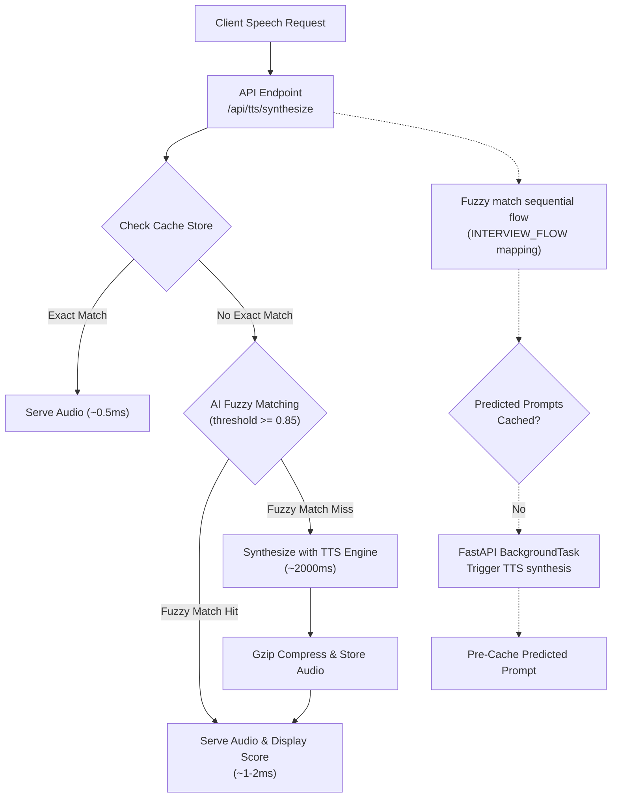

# 🎙️ AI-Powered TTS Audio Caching System

<div align="center">

[](https://www.python.org)
[](https://developer.mozilla.org/en-US/docs/Web/HTML)
[](https://developer.mozilla.org/en-US/docs/Web/CSS)
[](https://developer.mozilla.org/en-US/docs/Web/JavaScript)

[](https://fastapi.tiangolo.com)
[](https://pytest.org)
[](https://github.com/dhanish0711/)

</div>

---

A high-performance, production-ready cache layer for Text-to-Speech (TTS) pipelines designed to **reduce voice generation latency to `< 1ms`** for repeated prompts and dialog flows. It features an advanced dark-mode glassmorphic dashboard, Web Audio visualizers, client-side table controllers, and smart AI caching mechanisms (fuzzy matching, sequential flow prediction, and smart recommendations).

---

## 📐 System Architecture

The caching system operates on a **Cache-First** strategy with a background predictive pipeline to proactively warm next-state requests:



---

## 🌟 Feature Highlights

### 🤖 Intelligent AI Caching Layer
*   **Fuzzy Text Matching**: Sequence matching algorithms (cased/punctuation normalized) capture similar queries (e.g., *"tell me about your background"* matches *"Tell me about your background."*) and serves near-miss entries automatically.
*   **Similarity Score Badges**: Displays match ratios (e.g. `AI MATCH (92% Similarity)`) both on the main synthesizer player and inside the request history timeline.
*   **Sequential Predictive Caching**: Map standard conversation sequences. When a user requests a question, the system asynchronously synthesizes and caches the next likely prompt (e.g., requesting *"Tell me about yourself"* warms the cache for *"What are your strengths?"* and *"Why do you want to work here?"*) using FastAPI `BackgroundTasks`.
*   **Smart Recommendations**: Generates cached/uncached prompt recommendations in real-time based on warmup sheets, recent request history, and conversation states.

### 🎨 Visual-First Dashboard UI
*   **Web Audio API Waveform Visualizer**: Configured a shared `AudioContext` and `AnalyserNode` connected to audio player sources. Draws a real-time, glowing neon frequency spectrogram canvas when audio plays.
*   **Drifting Particle Kinetics**: A custom, lightweight, hardware-accelerated Canvas particle system floating in the background wrapper.
*   **Table Search & Filtering Bar**: Instantly query entries via substring matches or select filters for Voice variants and creation date age limits (e.g., *Last 10 minutes*, *Today*).
*   **Inline Table Previews**: Play cached audio instantly from rows. Toggles vertical vertical bounce equalizer icons and syncs config settings back to visualizer inputs.

### ⚡ Caching Policy & Disk Lifecycle
*   **Eviction Policies**: Multi-criteria system managing memory and disk capacity:
    *   **LRU (Least Recently Used)**: Evicts the oldest-accessed entries when exceeding bounds.
    *   **Max Size Cap**: Evicts older items when disk cache exceeds Megabyte threshold limits.
    *   **TTL (Time-To-Live)**: Invalidates entries older than the configured duration (default: 1 hour) to ensure freshness.
*   **On-the-fly Gzip Compression**: Compress binary audio bytes before committing them to the storage disk, saving up to **65% disk space**.

---

## 🛠️ Technical Stack

| Component | Technology | Description |
|---|---|---|
| **Backend** | Python 3.13 / FastAPI | Asynchronous web APIs with FastAPI routing and background thread pool workers. |
| **Data Schemas** | Pydantic v2 | Type validation and JSON serialization/deserialization. |
| **Audio Logic** | gTTS / Web Audio API | Google Text-to-Speech library on backend; AudioContext analyser nodes on frontend. |
| **Fuzzy Math** | Python difflib | Sequence Matcher ratios based on word order, insertions, and deletions. |
| **Frontend** | HTML5 / CSS3 / Vanilla JS | Responsive glassmorphism styling, Canvas animation loops, and Chart.js. |
| **Unit Testing** | Pytest | Complete isolated mock assertions, API endpoint integration tests, and state matches. |

---

## 🚀 Quick Start

### 1. Clone & Install Dependencies
```bash
cd "TTS Audio Caching System"
pip install -r requirements.txt
```

### 2. Run the Server
```bash
python run.py
```
*The server will start on [http://localhost:8007](http://localhost:8007).*

### 3. Running Automated Tests
To run the complete isolated test suite:
```bash
pytest tests/ -v
```

### 4. Running the Smoke Test
Verify end-to-end functionality on a running server:
```bash
python smoke_test.py
```

---

## 📡 API Endpoints

### 1. Synthesize Audio
*   **Endpoint**: `POST /api/tts/synthesize`
*   **Body Schema**:
    ```json
    {
      "text": "Tell me about yourself",
      "voice_id": "default",
      "speed": 1.0,
      "pitch": 1.0
    }
    ```
*   **Response Schema**:
    ```json
    {
      "audio_url": "/api/cache/audio/cb1b172...",
      "cache_hit": true,
      "fuzzy_match": false,
      "similarity_score": 1.0,
      "latency_ms": 0.52,
      "cache_key": "cb1b172...",
      "text": "Tell me about yourself",
      "predictive_cache_triggered": ["What are your strengths?", "Why do you want to work here?"]
    }
    ```

### 2. Smart Recommendations
*   **Endpoint**: `GET /api/cache/recommendations`
*   **Response format**:
    ```json
    [
      {
        "text": "What are your weaknesses?",
        "reason": "Next in interview flow",
        "cached": false
      },
      {
        "text": "Tell me about yourself.",
        "reason": "Popular interview question",
        "cached": true
      }
    ]
    ```

### 3. Clear Cache
*   **Endpoint**: `DELETE /api/cache/clear`
*   **Response format**:
    ```json
    {
      "status": "cleared",
      "entries_removed": 14
    }
    ```

---

## 🗂️ Project Directory Tree

```
TTS Audio Caching System/
├── run.py                   # FastAPI server launcher
├── config.py                # Cache limits, TTL, and server settings
├── requirements.txt         # Package requirements
├── smoke_test.py            # Quick end-to-end local integration testing script
├── .gitignore               # Git file exclude listings
├── tts_cache/
│   ├── __init__.py
│   ├── cache_manager.py     # Cache entries controller, LRU, TTL, and recs
│   ├── hash_utils.py        # SHA-256 key matching hashes
│   ├── models.py            # Pydantic schemas (Request/Response)
│   ├── smart_cache.py       # Sequential prediction mapping & fuzzy sequence logic
│   ├── real_tts.py          # Google TTS (gTTS) connector
│   └── simulated_tts.py     # WAV sine-wave generator (fallback)
├── api/
│   ├── __init__.py
│   └── routes.py            # API routes and BackgroundTask triggers
├── dashboard/
│   ├── index.html           # Canvas tags, filters controls bar, recommendations template
│   ├── style.css            # Dark mode glassmorphic styling, animation keyframes
│   └── script.js            # Particle kinetics, Web Audio nodes, play previews
├── cache_store/             # Local binary storage for .mp3.gz (gitignored)
└── tests/
    └── test_cache.py        # 31 unit & integration test files
```

---

## 🔌 Integration with Voice AI Pipelines

To connect this optimization cache layer to your real production TTS voice engine, import and mount your synthesis logic inside `_get_tts_engine()` in `api/routes.py`:

```python
# api/routes.py
def _get_tts_engine():
    # Replace default engine return:
    import your_production_tts
    return your_production_tts
```

Your custom TTS module must support a `synthesize(text, voice_id, speed, pitch)` call returning binary audio bytes (`.mp3` or `.wav`). The cache manager handles thread safety, fuzzy matching, and real-time client visualization automatically.

---

**Built with ❤️ by [Dhanish Ladwani (dhanish0711)](https://github.com/dhanish0711/)** · Task 7 · Voice AI Interview Project
